# 8 Ball Pool Game - Gioco di Biliardo 2D
## Caratteristiche
- Modalità giocatore singolo o doppio
- 2 tipologie di stecche
- Fisica degli urti semi-realistica
- Modalità "Mano tremolante"
- Modalità "Masse distorte"

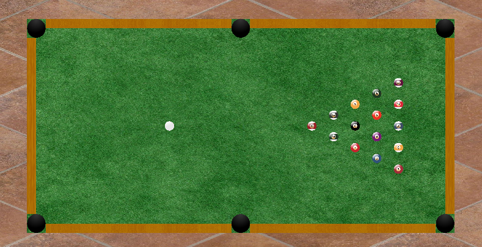

## Requisiti, compilazione ed esecuzione
Versione di CMAKE recente (4.0 >), necessaria per la compilazione automatica
di tutte le tappe (Utilizza GLOB_RECURSE per cercare ricorsivamente i sorgenti di ogni tappa).

Effettuare il clone della repository o scaricarla come file zip.
Sulla cartella principale della repository compilare con:
```
cmake -B build
cmake --build build
```
Sulla cartella principale della repository eseguire con:
```
./build/TappaX
```

## Descrizione
Il progetto riguarda la realizzazione di un gioco 2D di biliardo seguendo le classiche regole per il biliardo Italiano
e implementando una fisica semi-realistica degli urti che comprende urti elastici bidimensionali tra le entità presenti (Palline, muri, stecca).
La simulazione fisica è semi realistica in quanto non comprende la rotazione angolare (spin) delle palline e attrito dinamico / calore.

Il progetto è stato realizzando da me (Federico Urso) ed il codice è stato completamente scritto a mano.
Modelli LLM (ChatGPT e Proton Lumo) sono solo stati usati come supporto per la comprensione della fisica necessaria a modellare gli urti
e le collisioni e per fornire conoscenze di base di come ciò avviene nei giochi presenti sul mercato.

Il biliardo può essere giocato nei seguenti modi:
- **Singolo giocatore**: deve imbucare tutte le palline eccetto la bianca nelle buche lasciando la nera per ultima.
- **Doppio giocatore**: un giocatore gioca dal punto di vista di "Alice" ed un altro di "Bob", ogni giocatore ha assegnato una tipologia di palline da imbucare (Liscie / Rigate) e deve imbucare tutte le palline della sua categoria ed infine la pallina nera.

In entrambe le modalità se si imbuca la bianca si ottiene un fallo (mistake) e la pallina bianca viene riportata nella posizione iniziale.
Il fallo avviene anche se si colpisce con la stecca una pallina non bianca (Possibile se si usa l'opzione stecca libera).
Se dopo aver messo tutte le palline in buca si imbucano in contemporanea la bianca e la nera si perde la partita, come anche se si imbuca la nera prima delle altre.

## Comandi
### Stecca
- **Stecca libera**: si muove il centro della stecca tramite il cursore, si ruota la stecca con i tasti **A** e **D**.
- **Stecca ancorata**: la stecca rimane ancorata alla pallina bianca, si ruota muovendo il cursore del mouse.

Si aumenta la velocità (potenza) del colpo tramite la **rotella del mouse** e si colpisce la pallina con il tasto **K**.

## Modalità a difficoltà avanzata
- **Mani tremolanti**: il giocatore ha ansia da prestazione e quando colpisce la pallina la stecca si muove in modo casuale a causa del tremolio delle sue mani
- **Masse distorte**: il giocatore vuole allenare la memoria e decide di alterare le masse delle palline in maniera casuale in modo da dover stimare e memorizzare le palline più pesanti e leggere durante la partita

## Pannello e UI
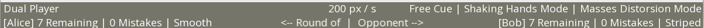

- Remaining --> Numero di palline rimanenti da imbucare (Eccetto la nera) 
- Mistakes --> Numero di falli commessi 
- Smooth / Striped --> Tipologia di palline da imbucare

In alto è presente l'indicazione della modalità e delle opzioni di gioco e la velocità impostata del colpo.

## Tappe

### Tappa01: realizzazione della struttura del progetto (file, namespace) ed input da catturare
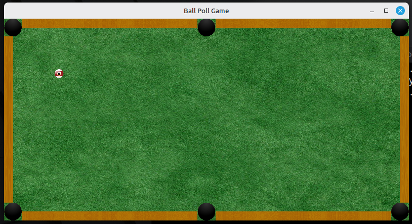

### Tappa02: implementazione iniziale della struttura stecca di tipologia "anchor"
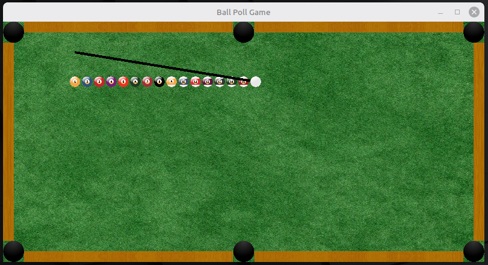

### Tappa03: dinamica iniziale per il colpo della stecca, accelerazione e stato del gioco
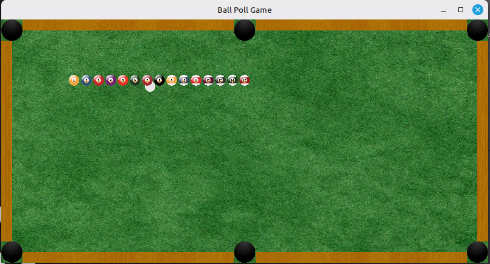

### Tappa04: inizio di modellazione delle collisioni tramite definizione della bounding box di un oggetto e hitbox composta da segmenti con relativa funzione di intersezione
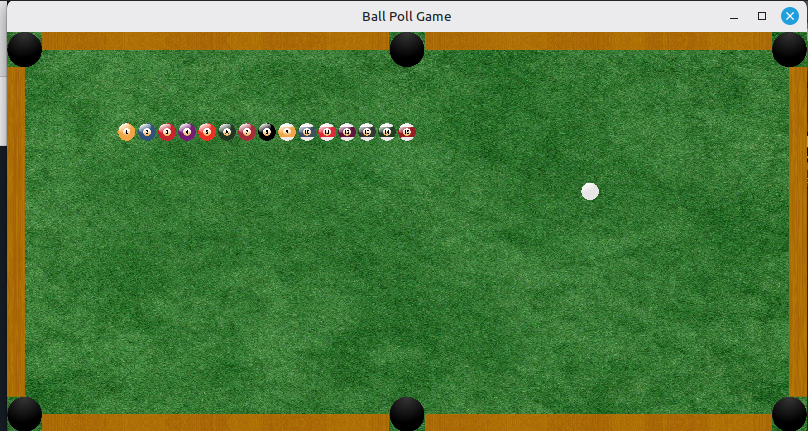

### Tappa05: correzione di bug sulle collisioni, sfondo, iniziale pannello superiore e resizing
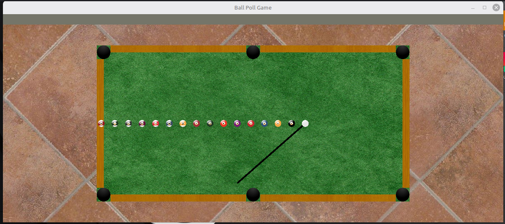

### Tappa06: implementazione della stecca con doppia modalità e con texture e altri miglioramenti alla fisica
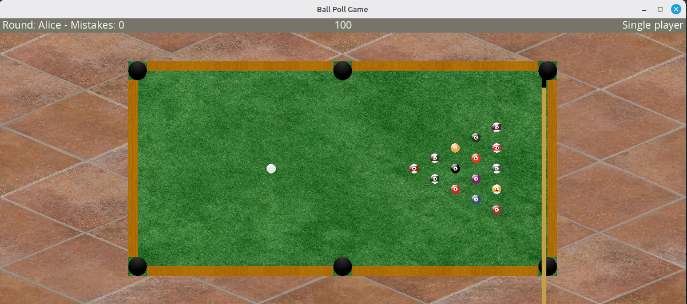

### Tappa07: logica del gameplay e dei calcoli di fine round, swap dei giocatori e altro bug fixing
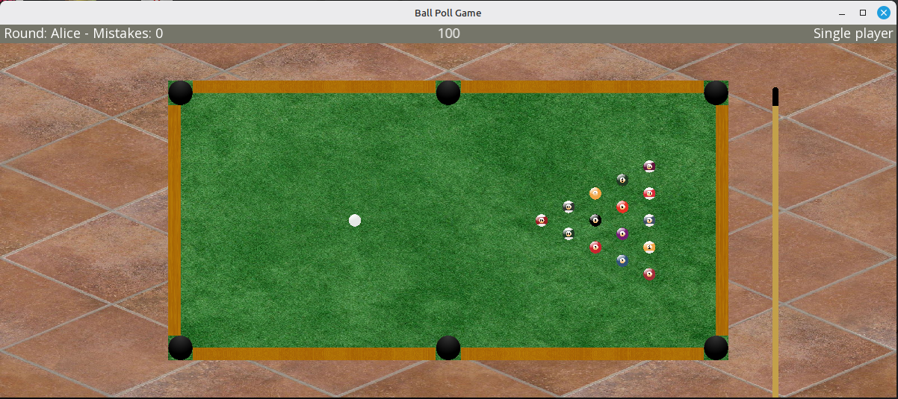

### Tappa08: altra logica di gioco, migliore pannello superiore e controlli di fine round
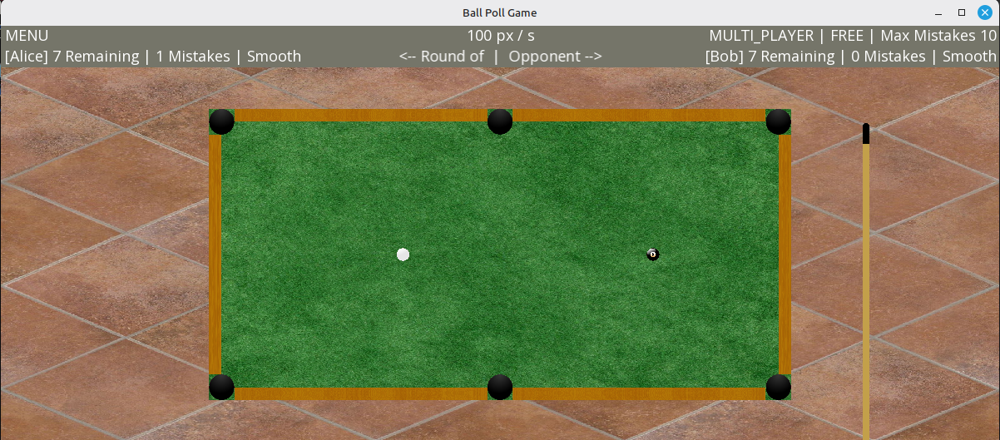

### Tappa09: implementazione delle due modalità a difficoltà aumentata
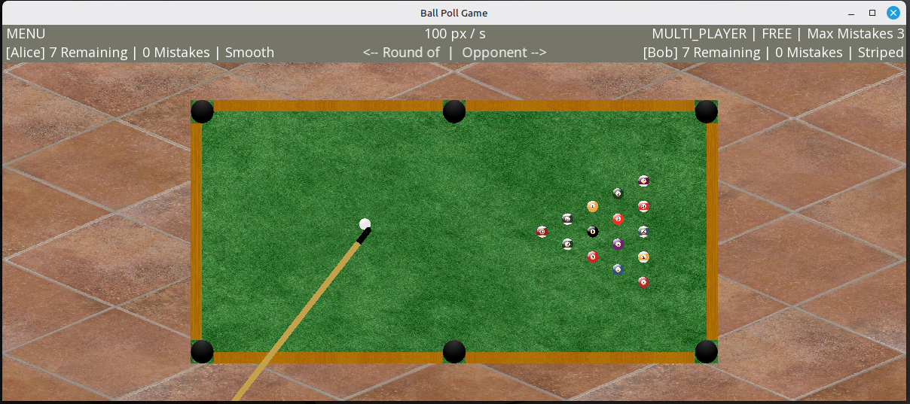

### Tappa10: realizzazione del menù, bug fixes, refactoring e pulizia del codice
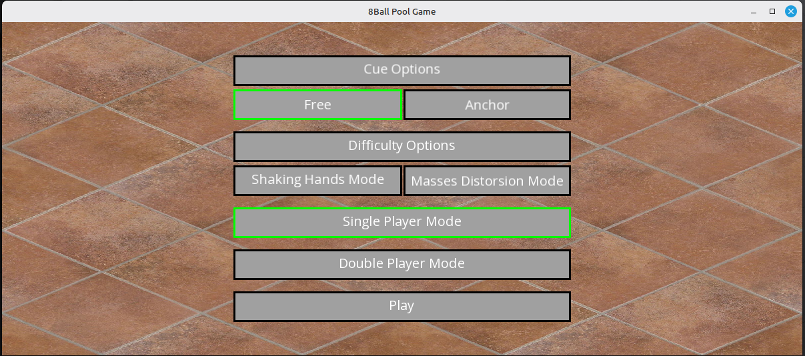
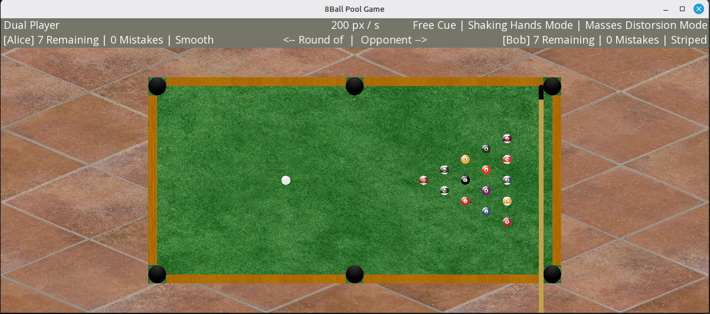


